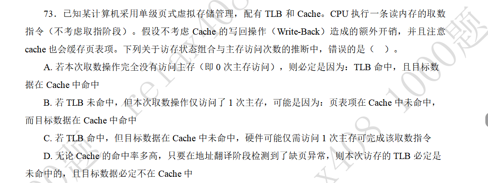
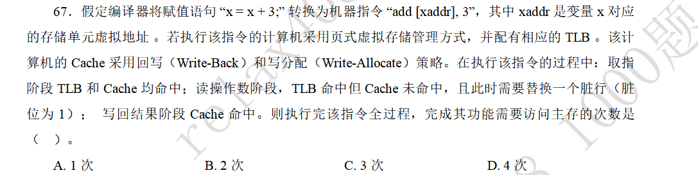
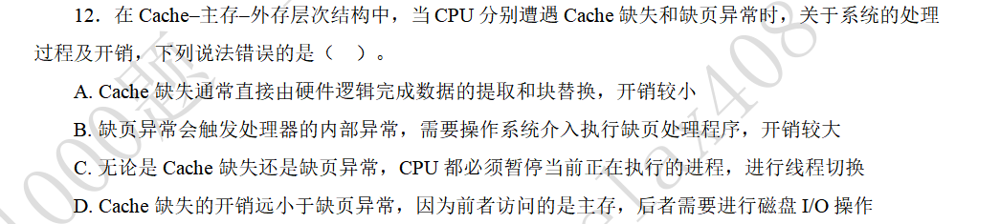

### TLB与Cache访存状态组合

#### 题目

#### 解答

这道题目的关键点是，cache缓存了页表项，因此多了一种访存状态组合：
- TLB未命中，而cache命中页表项。

那么A选项就是错的，除了题目描述的组合之外，还有一种组合：TLB未命中，cache页目录项命中，完成地址转换之后，cache数据也命中。

### 指令执行过程中的主存访问次数

#### 题目

#### 解答

首先来看这条指令完成了什么操作：取数字-做修改-存数字。

然后来看实际的执行路径：
1. 取指令：TLB和cache命中，无需访存
2. 读操作数：TLB命中，无需访存就找到对应物理地址。但是cache未命中，这样就需要替换，而题目中的cache采取了写回法，并且脏位为1，所以替换的时候需要将脏行写回内存，访存次数加一。而替换之后，需要给cache填入数据块，这时仍然需要访存一次来实现读入操作。
3. 写回结果：这时必然是命中的，并且因为修改了数据，需要将对应cache行的脏位修改为1，而因为没有将该行替换，所以不需要写回内存。

所以一共要访存两次。

### Cache缺失与缺页异常的处理

#### 题目

#### 解答

cache的缺失处理，一般是由硬件机制完成的，对程序员来说是透明的。并且由于是在主存之间处理异常，所以开销比较小。

缺页异常需要设计到硬盘或其他辅存设备的I/O，开销比较大。并且缺页异常的处理需要操作系统缺页异常处理程序（也就是软件）的介入。软件肯定要比硬件慢得多。

cache缺失是由硬件处理的，不用进行线程切换，而是通过流水线停顿（shall）来等待数据的换入。缺页异常则涉及到进（线）程的调度。
