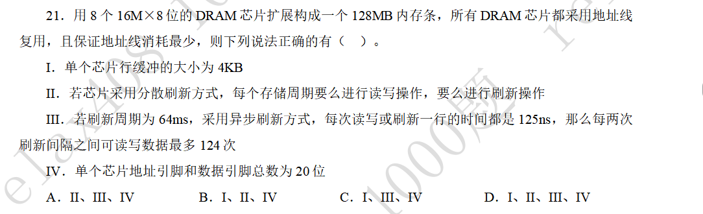
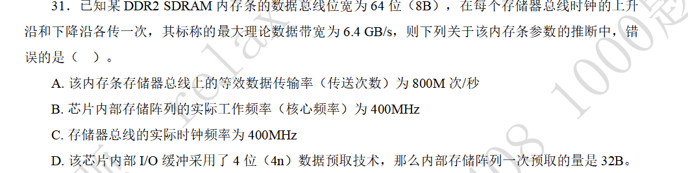

### DRAM芯片扩展与刷新

#### 题目

#### 解答

DRAM芯片采用引脚复用，本题中的DRAM芯片地址引线有16M，则行数和列数都是4K，即$2^{12}$ ，而数据宽度为8位，则每行的大小为4KB。行缓冲的大小与DRAM芯片的行大小一致，即4KB。

这同时能够解决命题Ⅳ。地址引脚为12位，数据引脚位8位，所以一共是20位。

分散刷新方式中，将刷新周期分散到每个存储周期里，进而消除掉死周期。这样每个存储周期就既有读写操作，也有刷新操作。

异步刷新方式中，将总共的刷新时间分布到整个周期里，这个周期是指，每行所能容忍的最大刷新间隔时间，也就是刷新周期。那么每行的刷新时间就是刷新周期与行数之比，即${64ms}/{4K}=15.625μs$。题目又说，每次读写或刷新一行的时间为125ns，即存取周期（刷新时间）是125ns。那么一个刷新间隔中，可以容纳$15.625μs/125ns=125$个存取周期。而这125个存取周期中，必须有一个周期是用于刷新的，所以剩下的124个周期，就是可读写数据的存取周期。

### DDR SDRAM相关计算

#### 题目

#### 解答

这道题目涉及到的知识点几乎没有考察过，只是作为了解才放到这里。

涉及到的公式有：
1. 理论带宽=等效数据传输率×数据总线位宽
2. 等效数据传输率=核心频率（实际工作频率）×数据传输频率

而DDR2中的2，就是指存储芯片I/O使用了$2^2$位的数据预取技术，一次预取的量为4×8B=32B。