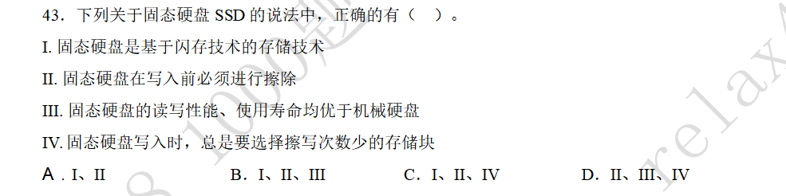

### 固态硬盘的读写与磨损均衡

#### 题目

#### 解答

固态硬盘是一种适用闪存技术的存储器，本质上是一种ROM。

固态硬盘只能写入擦除块，在进行写入之前必须选择某个块进行擦除。

固态硬盘的读性能优于机械硬盘，但是写性能因为需要擦除操作，而弱于机械硬盘。

固态硬盘写入时，擦除存储块的选择策略分为两类：
1. 动态磨损均衡：总是选择最少被擦除的块
2. 静态磨损均衡：在没有写入操作时也会研究可能的擦除块，综合各种因素，比如块中数据的最近使用时间，擦除次数等统筹安排。

很明显静态磨损均衡要优于动态磨损均衡。