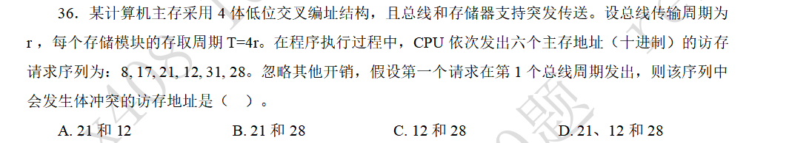
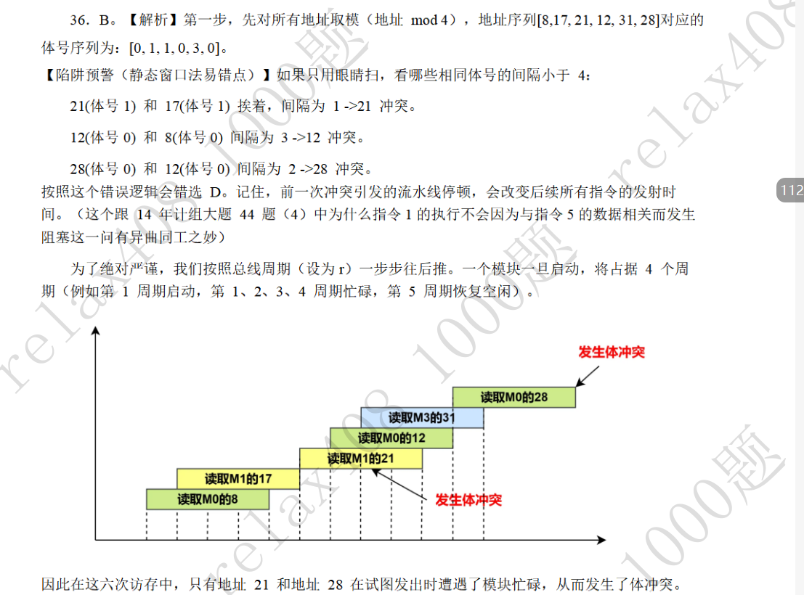

#### 题目

![[低位交叉中如何安排模块数量以使存储效率最大化.png]]
#### 解答

根据周所周知的结论，当存储体数等于存取周期与总线传输周期之比时，可以达到效率最大化。这个结论可以扩展到大于等于，即大于这个比值时，利用率仍然为百分之百。

#### 题目

![[多模块存储器提高读取速度的原理.png]]

#### 解答

多模块存储器是用于提高存储器访问速度的（而非用于提高存储效率和空间利用率）。原理就是每个模块都有独立的读写电路，对于多体并行存储器（高位交叉）就是多模块并发，对于多体交叉存储器（低位交叉）就是流水线技术。

#### 题目

#### 辨析图示

#### 解答

我们主要对图示做一个解释说明。

在低位交叉编址结构，并且支持突发传输的存储器中，进程可能会在每个总线传输周期的开始访问存储体，而一个存储体一旦开始工作，就必须忙碌一个完整的存取周期。在整个存取周期中，都无法响应其他访问，这样就是所说的体冲突。

而一旦发生体冲突，整个体系就会发生一次流水线延滞，整个系统的访存需要整体向后挪动，直至发生体冲突的存储体完成访存。理解这一点就掌握了解题的关键。

可以看到辨析图示中，最初的M0和M1是不冲突的，但读取21时就发生了冲突，因为这时M1仍然在忙碌。读取21的请求需要拖延到第六个总线周期才能再次访问M1，而==整个系统的读取请求都是整体向后挪动的==。后面的体冲突就不必解释了。因此只有21和28发生了冲突，而误以为的12和8却没有发生冲突。

低位交叉编址存储器与指令流水线的原理是共同的，指令流水线中冲突引起的流水线停滞也遵循这道题目所展示的流水线延滞原理。