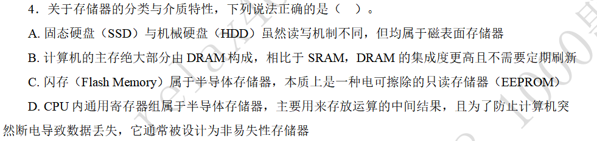

#### 题目

![[存储系统的地址.png]]

#### 解答

这道题目有争议。因为没有明确说明是否有虚拟存储系统。一般情况下会用到虚拟内存，那么答案就是B 虚拟地址。

CPU面向的是一个逻辑上连续的大容量存储器，它包含了内存和硬盘两部分，cache作为主存的副本。CPU不知道cache和硬盘的存在，它只与内存交换信息。因此使用虚拟地址访存的时候，通过硬件机制访问cache和硬盘。

#### 题目

#### 解答

SSD属于半导体存储器，核心存储元件为NAND ROM。HDD为此表面存储器。

DRAM需要定期刷新，刷新方法分为集中刷新、分散刷新和异步刷新三种方式。后面会有异步刷新相关的计算题。

闪存与SSD类似，本质上是一种EEPROM，读写时以页为单位，擦除时以块为单位。

CPU内的GPRs是一种半导体存储器，主要用来存放运算的中间结果，它虽然不是一种（非）易失性存储器，但是它的数据会在断电以后丢失。
