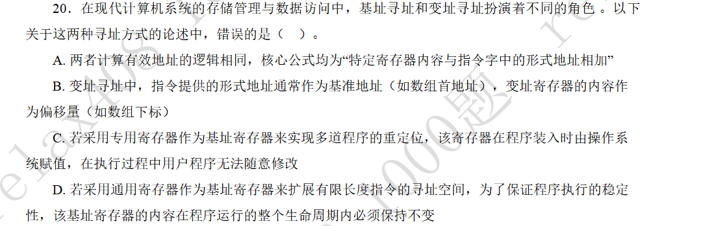
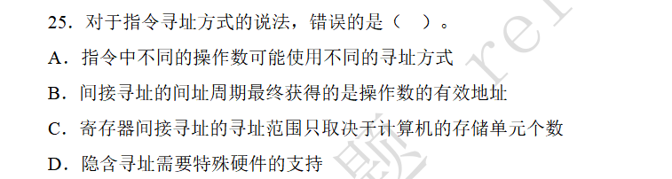

### 基址寻址与变址寻址

#### 题目-基址寄存器与变址寄存器的作用

#### 解答

需要澄清基址寻址方式中，寄存器的作用。CPU中有两种寄存器：
1. 通用寄存器：比如通用寄存器组GPRs。会被用于存放数据处理的中间结果，程序员可见。
2. 专用寄存器：比如栈顶指针寄存器。具有专门用途，一般不可见。

在基址寻址中，被用于==程序重定位==的寄存器是专用寄存器，它在程序运行过程中的确不可改变。

被用于==扩展寻址空间==（即寄存器间接寻址）时，则是通用寄存器，它是可以修改的。

### 寻址方式的综合比较

#### 题目-指令寻址方式的比较

#### 解答

隐含寻址的操作数一般是栈顶元素和次栈顶元素，需要堆栈的支持。

寄存器间接寻址的寻址范围会被通用寄存器的字长和计算机的存储单元个数共同限制。
