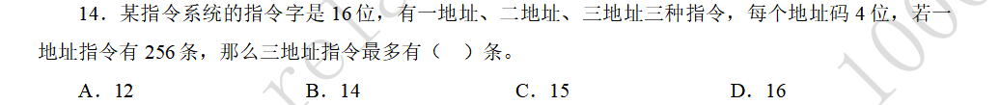

### 扩展操作码

#### 题目-不同地址数指令的数量关系

#### 解答

由一地址指令有256条可知，一地址指令至少要有8位扩展的操作码。占用了一种情况。

为了达到三地址指令最多，可以假设二地址指令只有一条，占用一种情况。

三地址指令的操作码位数位4位，一共16种状态，上面占用了两种。所以三地址指令一共还有14种。

这道题的重点是，二地址指令必须存在，可以让它的数量最少，来保证三地址指令数目最多。
