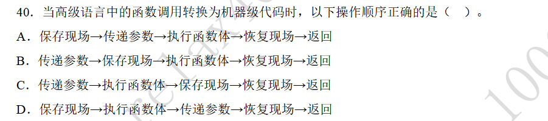
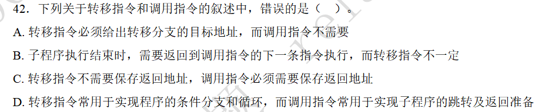

### 函数调用

#### 题目-函数调用的执行流程

#### 解答

这道题目直接背过。函数调用过程的操作顺序可以概括为：
1. 传递参数：首先将所需要的参数传递到通用寄存器中。
2. 保存现场：然后保存通用寄存器、PC等方面的内容。
3. 执行函数体
4. 恢复现场
5. 返回结果

#### 题目-转移指令与调用指令的区别

#### 解答

转移指令和调用指令都必须给出目标地址。转移指令是给出转移分支的目标地址，调用指令则是给出被调用程序的入口地址。
