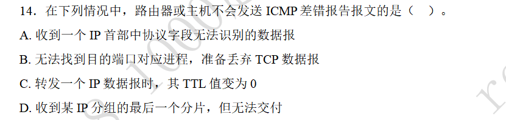

### ICMP差错报告

#### 题目

#### 解答

不会发送ICMP差错报告报文的情况有四种：
1. 对ICMP差错报告报文不再发送ICMP差错报告报文
2. 对包含多播或广播地址的报文不会发送ICMP差错报告报文
3. 对包含特殊地址的报文（全零，全一，本地环回测试等）的报文不会发送ICMP差错报告报文
4. 对第一个分片的IP数据报分片之后的所有IP分片不会发送ICMP差错报告报文。

注意，可能会对第一个分片发送ICMP差错报告报文。
