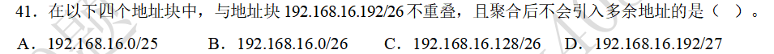
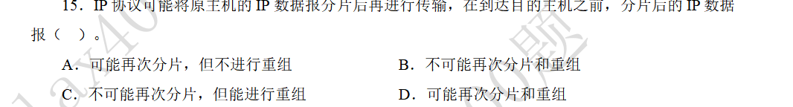

### CIDR地址块与路由聚合

#### 题目

#### 解答

关键理解什么是聚合后不会引入多余地址。是指聚合后产生的地址条目，必须等于原地址的并集。

下面分析选项：
1. A选项与题干中的地址块不重叠，聚合之后的地址为192.168.16.0/24。这显然不等于原来两个地址的并集
2. B选项与题干中的地址块不重叠，聚合之后的地址为192.168.16.0/24，同样不等于原来两个地址的并集。
3. D选项提供的地址，被题干中的地址块包含了。

C选项与题干中的地址不重叠，聚合之后的地址为192.168.16.128/25，恰好为原来两个地址的并集。

### IP协议的分片与重组

#### 题目

#### 解答

IPv4协议中，在DF=0的情况下，IP数据包可以在源主机和中间节点分片，但只能在目的主机重组。根据首部中的标识、MF/DF标志位、分片偏移量来完成重组。

IPv6协议中，只能在源主机分片，在目的主机重组。中间节点不能分片，如果中间节点发现IP数据报超过了链路的MTU，就会丢弃数据报，然后发送ICMPv6差错报告报文。
