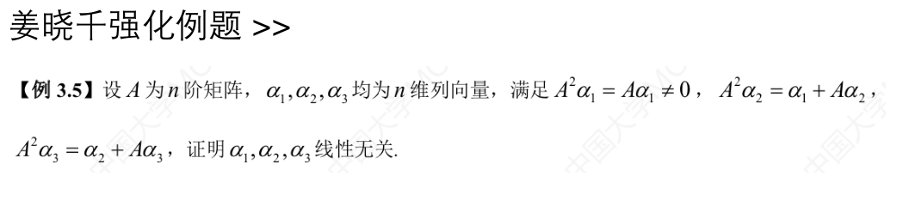
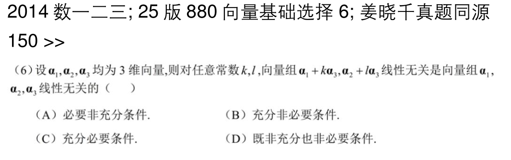
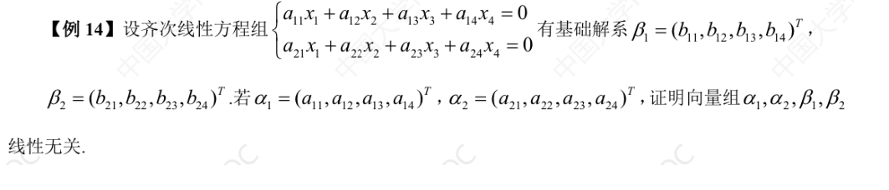
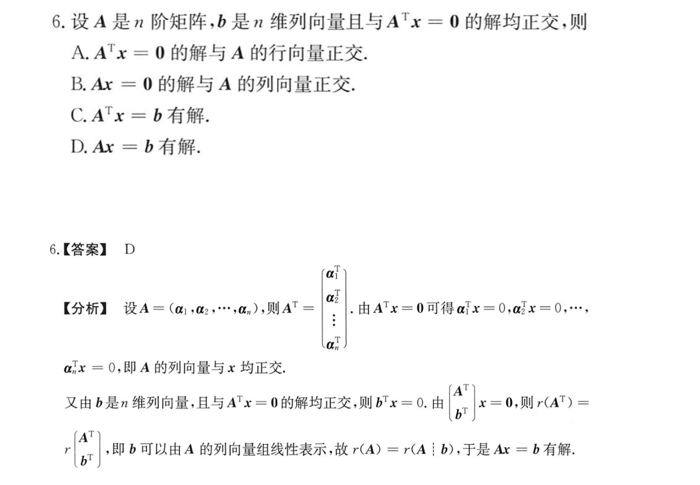

## 线性表示

### 由向量组的秩推导线性相关性（重点）

#### 题目

![[向量-向量组的秩推知向量组的线性相关性.png]]

#### 总结

这道题目提醒我在处理向量组的线性表示问题时，要用秩的思维考虑问题。对每个选项都做具体分析
A. 因为题目中的向量都是三维的，所以当${\alpha}_{1-3}$是线性无关的时候，它们一定是极大线性无关组，一定能线性表示任意三维向量。而选项中条件为$\alpha_4$不能有这个向量组线性表示，即利用逆否命题，这个向量组一定是线性相关的。
B. 这个选项需由排除法得到
C. 由不能线性表示可得到$r(\alpha_1,\alpha_2){\lt}r(\alpha_1,\alpha_2,\alpha_3)$和 $r(\alpha_2,\alpha_3){\lt}r(\alpha_4,\alpha_2,\alpha_3)$两个不等式，经讨论（讨论过程隐去，后来再次看这个题请自行思考）得到$r(\alpha_2,\alpha_3,\alpha_4)=3$，即极大线性无关组，任一三维向量都可以被这个向量组表示。
D. 对向量组组成的矩阵做初等变换，可以得到如下等式$r(\alpha_1,\alpha_2,\alpha_3)=r(\alpha_1,\alpha_2,\alpha_3,\alpha_4)$，这就是向量线性表示的标准定义式。

#### 题目

![[向量-线性表示推理-小表大，大相关.png]]

#### 解答

运用到的结论如下：
1. 向量组(Ⅰ)可由向量组(Ⅱ)表示，则说明(Ⅰ)的秩小于(Ⅱ)的秩。
2. (Ⅰ)的秩小于等于r，(Ⅱ)的秩小于等于s

然后对每个选项形成一个不等式链
1. A选项，无法得到有效信息
2. B选项，无法得到有效信息
3. C选项，无法得到有效信息
4. D选项，可以推知(Ⅰ)的秩小于s，即小于r，则(Ⅰ)线性相关

这里套用了一个结论：小可表大，大必相关。即向量个数较小的向量组可以线性表示向量个数较大的向量组，那么大向量组一定是线性相关的。

## 线性无关

### 线性无关的证明方法

#### 题目（矩阵形式）

![[向量-线性无关-利用特征向量的性质.png]]
#### 解答

**第一种方法**

由特征向量性质可知，不同特征值对应的特征向量一定线性无关。我们对题目要求的两个向量列出线性表示的定义式：
$$
k_1\alpha_1+k_2A(\alpha_1+\alpha_2)=0=>(k_1+\lambda_1)\alpha_1+k_2\lambda_2\alpha_2=0
$$
**第二种方法**

考虑两个向量的秩$r(\alpha_1,A(\alpha_1+\alpha_2))=r(\alpha_1,\lambda_1\alpha_1+\lambda_2\alpha_2)$进而化为$(\alpha_1,\alpha_2)A$，A是一个对角矩阵，对角元素为$1,\lambda_2$。由于$(\alpha_1,\alpha_2)$线性无关，所以$r(\alpha_1,A(\alpha_1+\alpha_2))=r(A)$，只有$\lambda_2$不等于0，两个向量才线性无关。
#### 题目（线性方程组形式）

![[向量-证明线性无关-方程组法.png]]
#### 解答

充分性：首先将向量组线性无关翻译成方程组：$Ax=0$只有零解，同时左乘$A^{T}$，仍然等于0。这说明$A^{T}A$可逆，即行列式不等于0。

必要性：由$A^{T}A$行列式不等于0可知$A^{T}Ax=0$只有零解。同时左乘$x^{T}$，得到$x^{T}A^{T}Ax=0$，即$(Ax)^{T}(Ax)=0$，这是一个向量内积，即一个数字。令$Ax=(y1,y2,...,y_n)^{T}$，则根据前面的向量内积，得到$\sum_{k=1}^{n}{y_k}^{2}=0$，即每个y都等于0。也就是说Ax=0只有零解。即向量组线性无关。

#### 题目（利用矩阵作用关系证明线性无关）

#### 解答

常见的题型形如$A\alpha_i=\alpha_j$。这道题目给出的形式需要转换一下，根本思想是将同一下标的向量放在同一边，转换如下：$A^{2}\alpha_i=\alpha_j+A\alpha_i=>(A^{2}-A)\alpha_i=\alpha_j$。

继续证明线性无关。利用定义式，写出线性表达式。然后乘以$A^{2}-A$，这样就得到$k_2\alpha_1+k_3\alpha_2$，继续如上操作，就可得到$k_3\alpha_1=0$，这样就得到了$k_1,k_2,k_3$都等于0，即线性无关。

#### 题目（含任意参数的向量组线性无关性）

#### 解答

充分性：题目中给出的常数k和l都是任意常数，所以我们让它们都等于0，这样就得到了$\alpha_1$和$\alpha_2$线性无关。我们假设向量组线性相关，得到$\alpha_3$可以由$\alpha_1$和$\alpha_2$线性表示，将其反代到$\alpha_1+k\alpha_3,\alpha_2+l\alpha_3$中，可以化简为$(\alpha_1,\alpha_2)$的形式，得到$(\alpha_1,\alpha_2)$线性相关，与前面得到的结论矛盾。所以向量组线性无关。

必要性：大向量组无关，小向量组必然无关。

## 向量空间与正交性

### 基础解系与系数向量的关系

#### 题目（系数向量与基础解系）

#### 解答

基础解系的性质是，基础解系与系数矩阵的行向量正交。

### 零空间与列空间的正交关系

#### 题目（左零空间的正交补）

#### 解答

由向量b与$A^{T}x=0$的解都正交可以知道，对于任意一个方程的解x，都有$b^{T}x=0$。也就是说，向量b与$A^{T}x=0$的解空间是正交的。又由于齐次方程解空间中的解，与矩阵A的列向量张成的空间正交，所以向量b就落在了A的列空间中。也就是说b可以由A的列向量线性表示，表达成线性方程组就是$Ax=b$有解。

用秩的思想来解释，由于对于任意一个方程解x，都有$b^{T}x=0$，说明方程$Ax=b$和$b^{T}x=0$同解，也就是说$r(A|b)^{T}=r(A)$，即$r(A|b)=r(A)$，也就是说$Ax=b$有解。

## 向量组等价
### 向量组等价的定义和证明

#### 题目
![[向量-向量组等价-用矩阵证明等价性.png]]

#### 解答

向量组等价的定义为：两个向量组可以互相线性表示。区别于矩阵等价——矩阵等价的充要条件是两个矩阵的秩相等。

直接利用线性表示相关的结论，得到向量组α组成的矩阵列满秩，即$r(A)=k$。而向量组α可由向量组β线性表示，β的秩肯定大于等于k，而β是一个k列的向量组，即它的秩小于等于k，两个条件共同推导出β的秩为k。也就是说：$r(A)=r(B)=k$。

下面讨论$r(A,B)$。由于矩阵A和矩阵B等价，所以$r(A,B)=r(A)=r(B)$。即向量组等价。

#### 题目
![[向量-向量组等价的定义.png]]

#### 解答

由题意知，$k_1$和$k_3$都不等于0。则$\alpha_1$可由$\alpha_2$和$\alpha_3$线性表示，$\alpha_3$可由$\alpha_2$和$\alpha_1$线性表示。则对于C选项，$\alpha_1,\alpha_2$可表示为$\alpha_2,\alpha_3$，即C选项正确。
