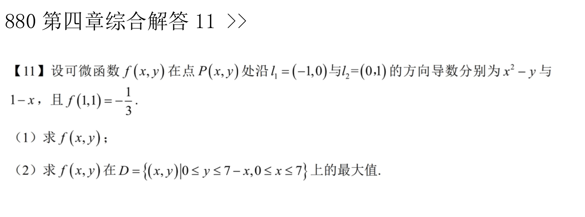
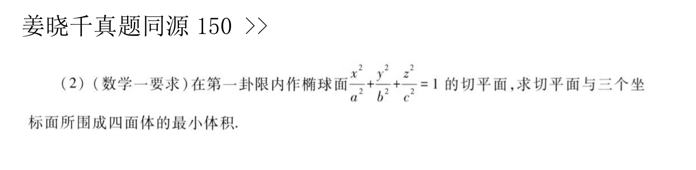
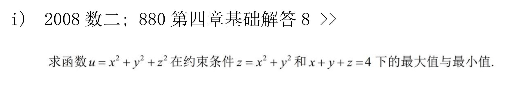
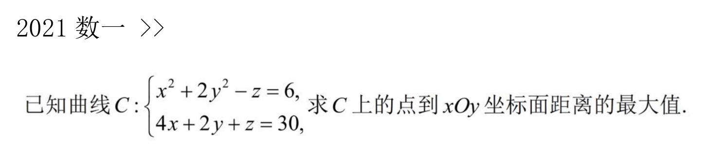
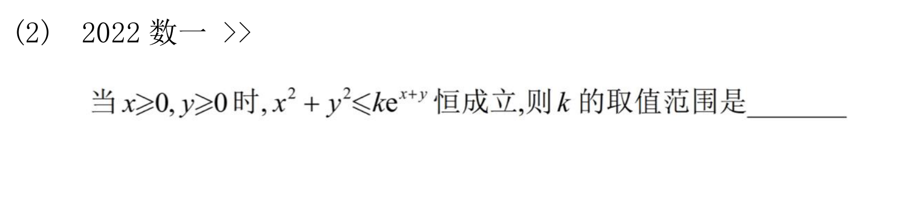
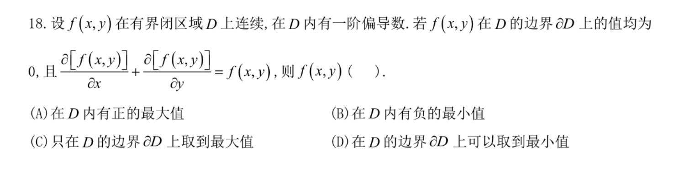

## 多元微分的计算、性质和证明

### 已知关系式求函数表达式-“偏微分方程”

#### 题目

#### 总结

没太有技术含量。单纯是计算问题

### 已知关系式求函数表达式
#### 题目

![[多元微分-已知偏微分关系式求函数表达式.png]]
#### 总结

这道题目的关键是令$u=x,v=x+y$。

### 已知方向导数求函数表达式与闭区域最值

#### 题目

#### 总结

## 多元微分的几何应用

### 曲面切平面与几何体体积最值

#### 题目

#### 总结

## 多元函数极值

### 具体函数表达式的极值，表达式复杂
#### 题目

![[多元微分-复杂具体函数求极值.png]]

#### 总结

关键是将$y^2$移到方程右边，然后做对数化。
此外，由于分母上有$y^2$，在$y=0$时没有定义，所以需要在x轴的上下两侧做分类讨论。

### 隐函数-复合函数极值的充分条件判定
#### 题目
![[多元微分-隐函数极值-极值的充分条件.png]]

#### 总结

需要明确这道题目要求的是一元函数$y=y(x)$的极值。注意到F（x，y）不仅是多元函数，还是复合函数，求导的时候需要写出$\frac{dy}{dx}$和$\frac{d^{2}y}{dx^{2}}$。然后判断即可

### 两个约束条件下的条件极值

#### 题目一

#### 总结

处理两个约束的问题时，有两种方法：
1. 将其中一个约束条件代入到另一个条件中，进而化约为一个约束条件。
2. 仍然使用拉格朗日乘数法解决，一般可以将对x，y，z求偏导的方程做数乘和加减操作，从而得出拉格朗日参数或者自变量之间的关系。

#### 题目二

#### 总结

这道题目属于数一专项，处理空间坐标系中点到坐标面的距离时，可以用$z^2$来处理（点到xOy坐标面的距离）。使用上一道题目讲到的思路：
1. 将其中一个方程带入，化为一个约束。
2. 拉格朗日乘数法直接列表达式，然后利用系数之间的关系化简。

### 含参数不等式恒成立的取值范围

#### 题目

#### 总结

应该很容易就知道这道题目是考察多元函数的极大值。不等式右边存在指数函数，有良好的求导计算性质。两边同除$e^{x+y}$即可，构造函数$f(x,y)=e^{-x-y}(x^2+y^2)$，并且满足约束条件$x\ge0,y\ge0$。问题就转换为了条件极值问题。

首先在区域内求极值，然后分别在x=0和y=0这两个边界上求极值。

### 已知闭区域边界值的极值判断

#### 题目

#### 总结

这道题目需要分类讨论，分别在边界上和区域内进行讨论。注意题目中给出的偏导数和函数值的关系式是对整个区域都适用的。
1. 假设区域内有正的最大值，即存在$f(x_0,y_0)\gt0,(x_0,y_0)\in{D}$，这样就与条件给出的关系式矛盾
2. B选项所给的有负的最小值同样因为矛盾而错误。

实际上，由关系式可以得到在整个区域（包含边界）之内，函数是恒等于0的。这样0就是函数的最大值，同时也是最小值。因而选D。
