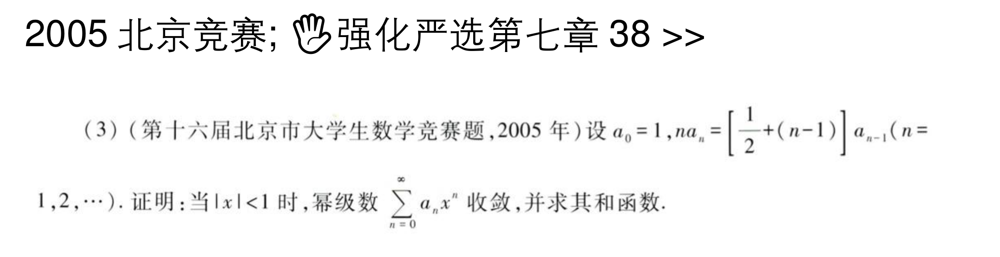
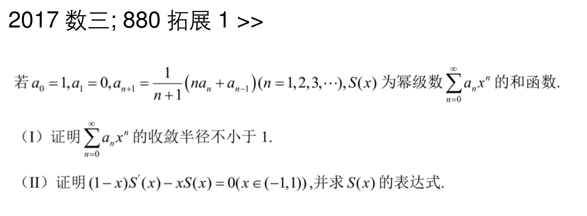

## 抽象级数

### 级数定义-部分和收敛-放缩

#### 题目一

#### 总结

第一问使用的知识点是级数收敛定义，即部分和收敛。算式处理中会用到无穷大的倒数，级数发散对应的部分和数列。

第二问则是在第一问结论的基础上进行放缩，由第一问和正项级数性质可知，Sn+1大于Sn，这个不等式可以用于放缩，最终得出正项级数的比较审敛法经典形式。

#### 题目二

#### 总结

这道题目类似题目一。

### 两个数列的关系式-推导数列的敛散关系

#### 题目一 真题

#### 总结

第一问用到条件中给出的关系式，将等式两边的余弦函数凑到一起，得到两者相减等于an，进而大于零的条件。根据这个条件、余弦函数的性质和两个数列的取值范围，得知an是小于bn的，这是典型的正项级数比较审敛法。最后根据级数收敛的必要条件即可证明

第二问仍然使用比较审敛法。先将分子替换为余弦函数做差。然后与已知的收敛数列bn作比较。最终得到比式小于1
#### 题目二 真题变式 竞赛题

#### 总结

与题目一类似。区别是这道题目隐含了对bn收敛性的讨论。

### 与方程根有关-放缩

#### 题目

#### 总结

证明存在性：利用连续函数的零点定理。函数在0处小于0，在1处大于0，且函数连续，故函数一定在（0，1）上取得零点。

证明收敛性：xn可以表示为$\frac{1}{n}$，而α>1，所以肯定是收敛的

## 幂级数审敛

### 幂级数常规收敛域中较难的题目

#### 题目

![[无穷级数-返璞归真用必要条件.png]]

#### 总结

这道题目可用比较审敛法。先放缩，前面这一大坨式子小于等于1，这样就变成了$x^{2n}$，显然是$(-1,1)$

### 区间压缩定理的运用

#### 题目

![[无穷级数-区间压缩-微分中值定理.png]]

#### 总结

第一问需要用到区间压缩定理。遇到用函数递推表示的级数时，一般会用到这种方法。将xn+1替换为f（x）。这样$x_{n+1} - x_n$就会转化为$f(x_{n})-f(x_{n-1})$。根据拉格朗日中值定理，$f(x_{n})-f(x_{n-1})<(x_{n}-x_{n-1})f'(ξ)，其中ξ∈(x_{n-1},x_{n})，进而小于\frac{1}{2}(x_{n}-x_{n-1})$，将这个放缩过程重复下去，最终得到$x_{n+1} - x_n<x_1-x_0$，即小于一个常数。

将第一问按照级数部分和定义运算，可以得到$x_{n}-x_1$存在，即$limx_n$存在。证明第二问的第二个结论则需要用到构造函数（作差）和微分中值定理

### 阿贝尔定理的运用

#### 题目

![[无穷级数-幂级数-阿贝尔.png]]
#### 总结

$\sum_{n=1}^{\infty}a_{2n}x^{2n}$是$\sum_{n=1}^{\infty}a_{n}x^{n}$一个子级数，他们的敛散性是完全一致的。根据阿贝尔定理：当$x∈(-R,R)$时，是绝对收敛的；当$|x|>R$时，是发散的；而在端点$-R$和$R$上时，敛散性不确定。

也就是说，当$|r|=R$时，不能确定级数是否收敛或是否发散，这样就排除了C和D。

对于B选项，可以构造特殊级数来证明其错误。

A选项实际上就是阿贝尔定理的逆否命题，也就是"$|r|<R$时，级数绝对收敛"的逆否命题。

-----
### 疑难未解决题目（已解决 7.22）

#### 题目

![[无穷级数-作差证收敛.png]]

#### 总结

首先要做一个形式的转换。$ln(1+n)$可以转换为$\frac{1}{x}$在$1$到$n+1$上的积分。而这个积分可以根据积分区间的可加性，转换为一个和式。这样xn的形式就统一为一个和式。使用单调有界定理即可证明第一问。

第二问则需要做一个变形，与xn结合起来，然后利用夹逼准则解决。

----
## 幂级数求和
### 向常见幂级数转换
#### 题目

![[无穷级数-幂级数求和-三角常用公式.png]]
#### 总结

这道题目给出的幂级数形式与我们熟知的$cos(x)$类似。然而，x的幂指位置是$n$，而非$2n$，这是与余弦函数不同的地方。我们可以适用变形$x^{n}=(x^{\frac{1}{2}})^{2n}$，这样就规范了形式。

从而得到最终答案为$cos(x^{\frac{1}{2}})$

#### 微分方程法
#### 题目
![[无穷级数-幂级数求和-微分方程法.png]]

#### 总结

第一问先拆开对数式，再求高阶导，可套用公式。

第二问根据第一问得到的形式做幂级数求和，相对简单。

#### 系数递推法
#### 题目
![[无穷级数-幂级数求和-系数递推.png]]

#### 总结

第一问根据题目给出的关系式——一个可分离的微分方程——求得$f(x)$，然后根据初值确定特解。比较简单。

第二问则不能硬算。第一问求得的函数，明显可以做三角代换，这样就将无穷的积分区域替换为$\pi$了。然后利用偶函数的性质和华莱士公式的递推性质，得到系数的关系。最后的幂级数求和就不细讲了。

### 递推关系转化为微分方程

#### 题目一-$na_n$型递推

#### 总结

条件中给出了与$na_n$相关的递推式，容易考虑到，对幂级数==逐项求导==会出现这个表达式。因此对幂级数逐项求导，然后代入递推式，可以得到与和函数相关的微分方程。

计算中最重要的一点就是要将连加式中的起点对齐，比如需要转化为n=0，然后才能继续计算。如果当前起点的前一项为0的话，可以将起点向前推进，而不影响运算的正确性。

#### 题目二-由后两项推知前一项

#### 总结

这道题目是上面题目的变式，将等式右边的分母移动到等式左边，就转化成了题目一中给出的递推形式。

其余地方与题目一相同，不再赘述。
